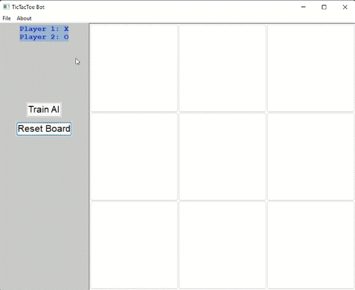

# Tic-Tac-Toe Game with AI

     

Example with AI playing as O and human player playing as X.

A desktop application that implements the classic Tic-Tac-Toe game.
The application includes implementation of a reinforcement learning agent that learns to play the game optimally.

This application is implemented using C++ in an OOP framework.

## Reinforcement Learning Agent

The reinforcement learning agent uses after value function approximation. A 3 layer neural network is used to approximate the after value function. 

The epsilon greedy policy is used with respect to the after values.

An Adam optimizer is used and optimization is performed on minibatches of returns sampled on previous episodes. Additionally, History data is saved in a buffer for replay.

## Running the application

### To build the code, two libraries are required:

1- The wxwidgets library is required to generate the game frame (https://www.wxwidgets.org/). The application was built using wxwidgets-3.1.5.

2- The Eigen Library is required for matrix calculations (https://eigen.tuxfamily.org/index.php?title=Main_Page). The version used is Eigen 3.4.0.
